# Mirror Project (Gitlab to Github)

## This project demonstrates how to mirror a GitLab repository to GitHub, ensuring that all commits, branches, and tags are automatically updated in the target repository. The mirroring process helps maintain consistency across platforms, improves code availability, and provides an additional backup of the source code.
# Step 1 :
Create a blank project and name it Gitlab-mirror-repo\
Then add user and select visibility level , Public. Checkin the project configuration in README
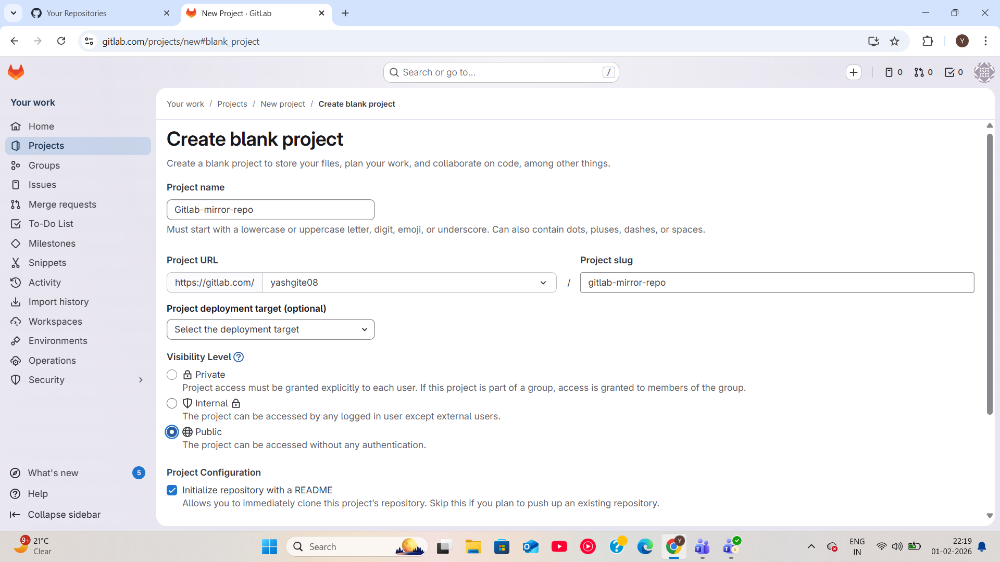
# Step 2 :
Create repository in Github and name it Github-mirror-repo
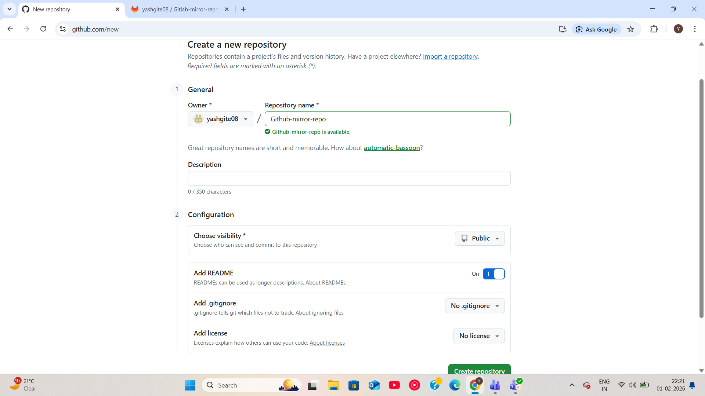
# Step 3 :
In Gitlab go in setting and chose Repository option
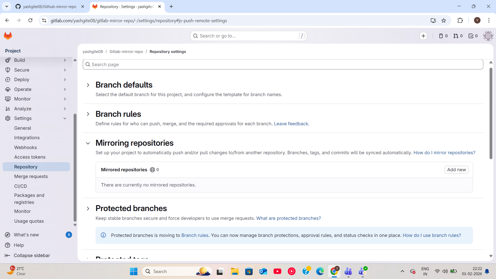
# Step 4 :
In mirror repository copy the Github-mirror-repo repository https code and paste it
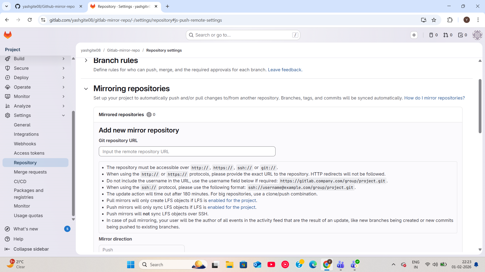
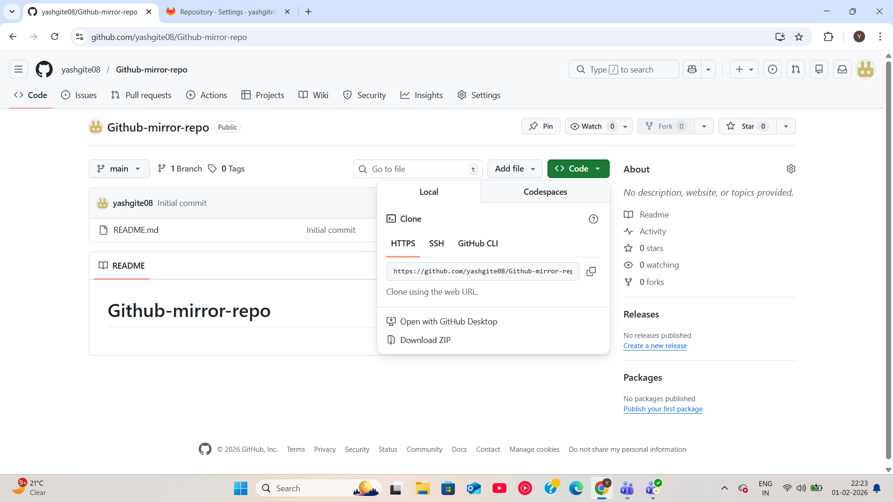
# Step 5 :
Go in Github developer setting and create Personal Access Token (classic)\
From the option General new token

# Step 6 :
Name the Personal Access Token and Checkin all the Select scopes in Github\
Paste the generated password in the Gitlab Mirror Repository User information
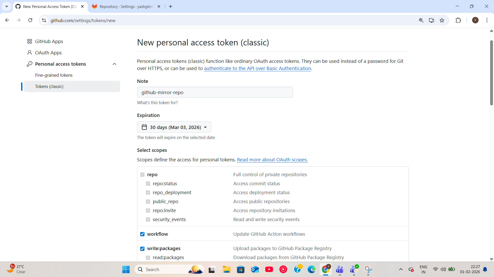
# Step 7 :
Copy the HTTPS code of Gitlab-mirror-repo project
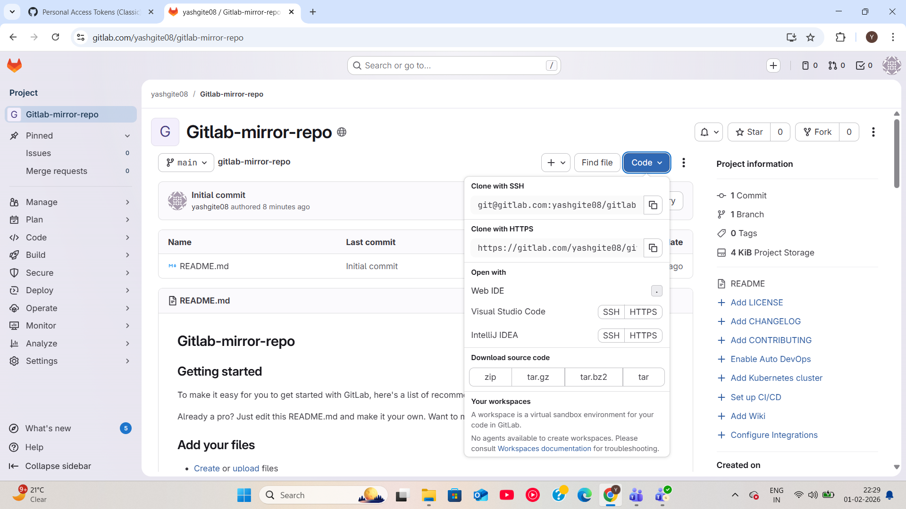
# Step 8 :
Open the Git Bash from your local machine
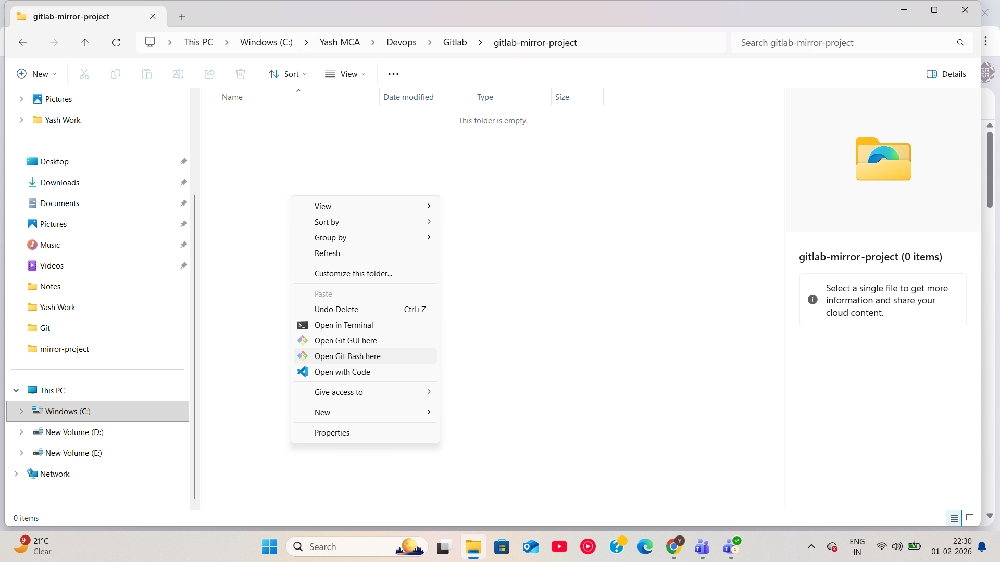
# Step 9 :
Now git clone the repository of Gitlab and do cd in Gitlab-mirror-repo and open VS Code from it.
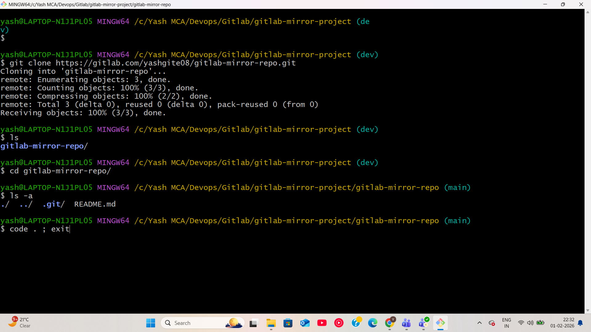
# Step 10 :
Create index.html file and edit it
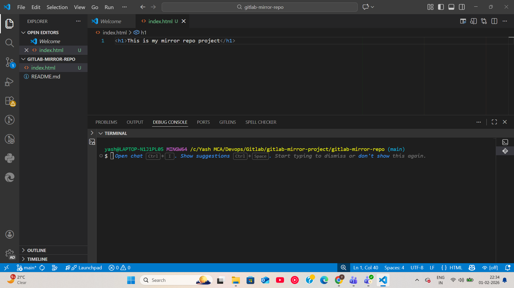
# Step 11 :
Now add the file to staging and commit area\
Push the file to Gitlab
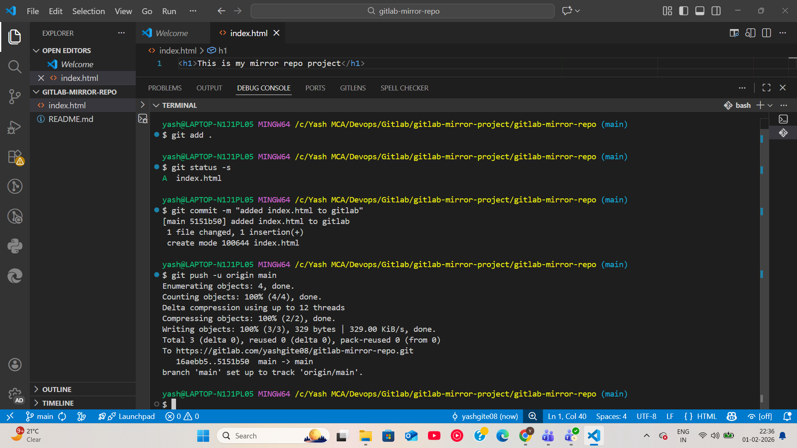
# Step 11 :
Now check the file was push both in Gitlab and Github
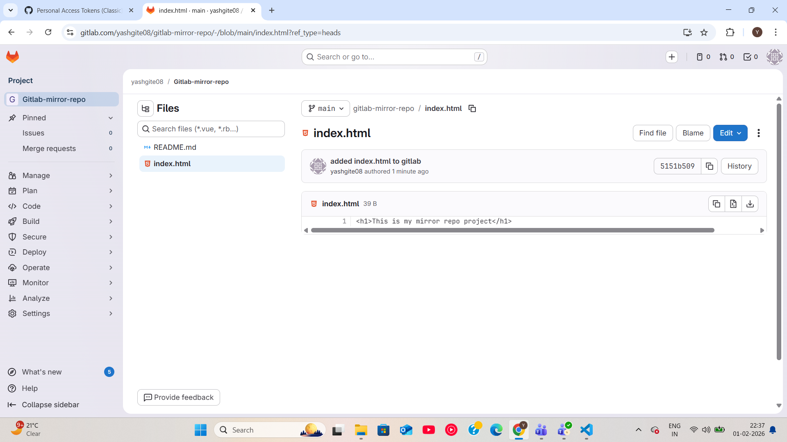
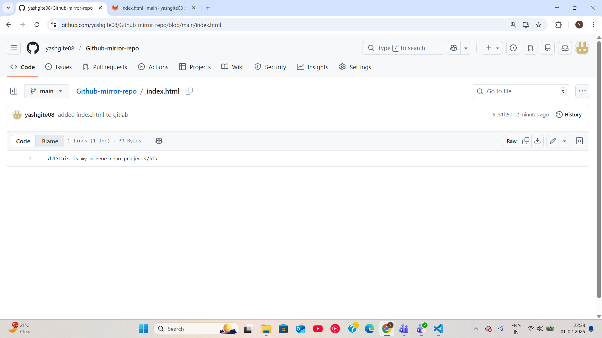
## Conclusion :
The Mirror Project (GitLab to GitHub) successfully demonstrates how to keep repositories synchronized across platforms. It helps in maintaining code consistency, improves accessibility, and provides a reliable backup. This project builds practical knowledge of Git, remote repositories, and real-world version control workflows.